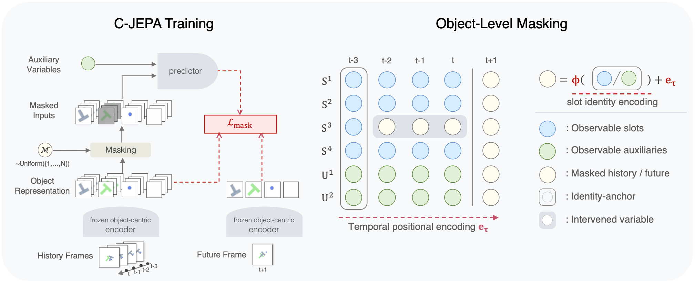

# C-JEPA

Official implementation of **Causal-JEPA: Learning World Models through
Object-Level Latent Interventions**.

[Heejeong Nam](https://hazel-heejeong-nam.github.io/),
[Quentin Le Lidec](https://quentinll.github.io/),
[Lucas Maes](https://lucasmaes.bearblog.dev/),
[Yann LeCun](https://yann.lecun.com/), and
[Randall Balestriero](https://randallbalestriero.github.io/).

[Paper](https://arxiv.org/abs/2602.11389) ·
[Project page](https://hazel-heejeong-nam.github.io/cjepa/) ·
[Checkpoints](https://huggingface.co/HazelNam/CJEPA)



C-JEPA masks complete object trajectories in latent space, then predicts the
masked history and future objects from the remaining context. This repository
contains only that contribution and thin data/training/planning entry points.
Environment management, HDF5 loading, training infrastructure, environments,
and MPC come from released `stable-worldmodel` and `stable-pretraining`
packages.

## Setup

Run one command:

```bash
./setup.sh
source .venv/bin/activate
```

`setup.sh` creates `.venv`, installs the locked dependencies, and puts the
inference-only VideoSAUR source under `.venv/src/videosaur`. Nothing is cloned
into the visible repository. The tested releases are:

- `stable-worldmodel==0.1.1`
- `stable-pretraining==0.1.7`

Datasets, downloaded encoder checkpoints, and model checkpoints live below
`$STABLEWM_HOME` (default: `~/.stable_worldmodel`):

```bash
export STABLEWM_HOME=/path/with/enough/storage  # optional
```

## Data

All data uses the current stable-worldmodel HDF5 schema. Dataset names resolve
under `$STABLEWM_HOME/datasets`.

### CLEVRER: download and convert

This single command downloads all official CLEVRER video archives and writes
the train/validation/test H5 files:

```bash
python scripts/prepare_clevrer.py
```

The converter stores 196×196 RGB frames with Blosc/Zstd compression. Full
CLEVRER is large. A range-download smoke conversion does not retain the 25 GB
ZIP archives:

```bash
python scripts/prepare_clevrer.py \
  --splits train val --max-videos 2 --download-mode range
```

### Raw pixels or pre-extracted slots

Training auto-detects the representation:

- an H5 `pixels` column uses the frozen VideoSAUR encoder;
- an H5 `slots` column bypasses the image encoder completely.

To pre-extract slots once:

```bash
python scripts/extract_slots.py \
  "$STABLEWM_HOME/datasets/clevrer_train.h5" \
  "$STABLEWM_HOME/datasets/clevrer_train_slots.h5" \
  --dataset clevrer
```

This is native stable-worldmodel support for slot representations: `slots` is
just another time-indexed H5 column, loaded by `swm.data.HDF5Dataset`. Action,
proprioception, and metadata columns are preserved.

## Object encoder checkpoints

Object-centric encoder *training* is intentionally not part of this repo.
When raw-pixel training or slot extraction first runs, the matching checkpoint
is downloaded automatically to
`$STABLEWM_HOME/artifacts/object-encoders/`:

| Dataset | Encoder | Checkpoint |
|---|---|---|
| CLEVRER | VideoSAUR | [download](https://huggingface.co/HazelNam/CJEPA/blob/main/clevrer_videosaur_model.ckpt) |
| PushT | VideoSAUR | [download](https://huggingface.co/HazelNam/CJEPA/blob/main/pusht_videosaur_model.ckpt) |

Override the path when needed:

```bash
python train.py data.encoder.checkpoint=/path/to/model.ckpt
```

SAVi, SlotFormer, ALOE, and copied third-party training trees were removed.
There are consequently no hidden Python constants or duplicate SlotFormer
configs to edit. Released SAVi-era checkpoints are not supported by this
refactor.

## Training

CLEVRER is the default:

```bash
python train.py
```

Use a pre-extracted-slot file with the same command and one override:

```bash
python train.py data.train=clevrer_train_slots.h5 \
  data.val=clevrer_val_slots.h5
```

PushT uses one data preset:

```bash
python train.py data=pusht
```

Common smoke-test overrides are standard Hydra overrides:

```bash
python train.py trainer.max_epochs=1 trainer.limit_train_batches=2 \
  trainer.limit_val_batches=1 loader.num_workers=0 loader.batch_size=2 \
  wandb.enabled=false
```

Checkpoints are written to
`$STABLEWM_HOME/checkpoints/cjepa/<dataset>/`. The `_object.ckpt` file is
directly loadable by `stable_worldmodel.policy.AutoCostModel`.

## Planning

Set `policy` to a checkpoint path relative to
`$STABLEWM_HOME/checkpoints`, without the `_object.ckpt` suffix:

```bash
python eval.py policy=cjepa/pusht
```

All planning settings are in `config/eval.yaml`; there are no values embedded
in `eval.py`. For a quick check:

```bash
python eval.py policy=cjepa/pusht eval.num_eval=1 eval.eval_budget=2 \
  eval.goal_offset=2 plan.horizon=1 plan.receding_horizon=1 \
  solver.num_samples=2 solver.topk=1 solver.n_steps=1 eval.video=false
```

## Repository layout

```text
cjepa.py                  C-JEPA architecture and stable-worldmodel adapter
encoder.py                checkpoint download and frozen VideoSAUR inference
train.py                  shared pixel/slot trainer
eval.py                   PushT planning
config/                   one train config, two data presets, one eval config
scripts/prepare_clevrer.py download-to-H5 CLEVRER converter
scripts/extract_slots.py  H5 pixels-to-slots converter
tests/                    fast model and H5 integration tests
```

## Architecture compatibility

The learnable C-JEPA predictor is unchanged: the mask token, temporal
positions, identity projector, full-attention transformer, feed-forward
blocks, and output projection retain the original shapes and computation.
The only model-facing cleanup is that action and proprioception are represented
as explicit, unmaskable nodes through the already-used AP-node pathway. The
surrounding adapter now accepts current H5 batches and the latest
stable-worldmodel planning protocol. No legacy loader or checkpoint shim is
included.
